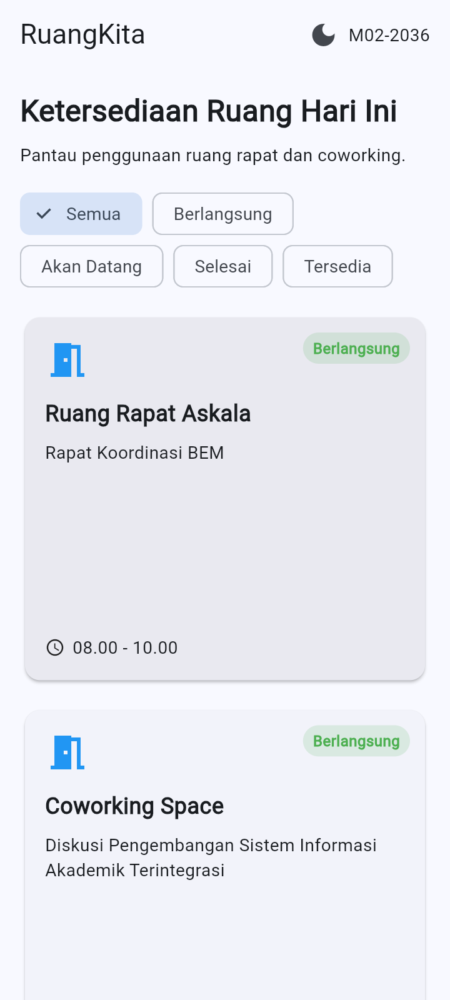
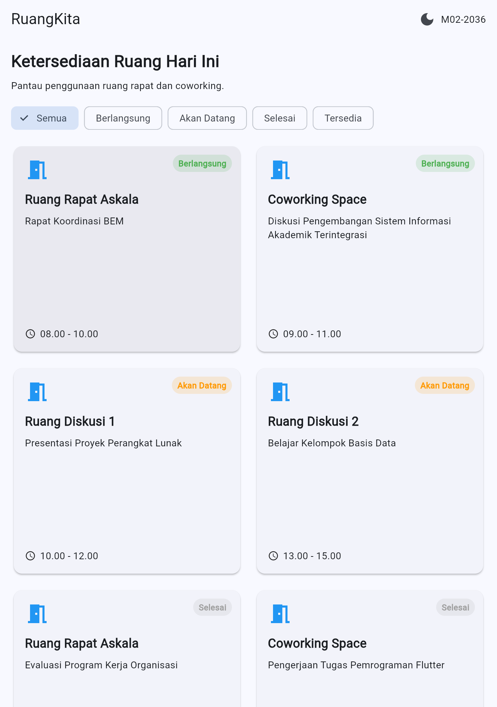

# DEBUG NOTES - MODUL 02 (RuangKita)

**Nama**: Raido Octaviandy  
**NIM**: 362558302036  
**Program Studi**: D4 Teknologi Rekayasa Perangkat Lunak  
**Domain**: Ruang Rapat & Coworking  
**Identitas**: M02-2036

Dokumentasi permasalahan nyata selama proses pengembangan antarmuka deklaratif dan responsif.

---

## Kasus 1: Kesalahan Import Model RoomSession

### 1. Gejala Masalah

Saat menghubungkan model `RoomSession` dengan halaman utama RuangKita, muncul error pada bagian import file. Aplikasi tidak dapat mengenali class `RoomSession` karena lokasi file model berada di folder yang berbeda.

### 2. Bukti Screenshot

- **Sebelum Perbaikan**: Muncul error pada bagian import `room_session.dart`.
- **Sesudah Perbaikan**: Model berhasil diimpor dan data ruangan dapat ditampilkan.

Screenshot: `screenshots/01_import_error.png`

### 3. Dugaan Akar Masalah

Kesalahan terjadi karena penulisan relative path pada import tidak sesuai dengan lokasi file `ruang_praktikum.dart`. File model berada di folder `lib/models`, sedangkan halaman berada di folder `lib/modul02/Study_kasus`.

### 4. Perubahan Kode (Solusi)

Mengubah relative path import agar sesuai dengan struktur folder proyek.

```dart
// Sebelum:
import '../models/room_session.dart';

// Sesudah:
import '../../models/room_session.dart';
```

### 5. Hasil Perbaikan

Setelah relative path diperbaiki, error import berhasil diatasi dan data ruangan dapat digunakan pada halaman RuangKita.

---

## Kasus 2: Penyesuaian Layout Responsive Berdasarkan Ukuran Layar

### 1. Gejala Masalah

Saat aplikasi dijalankan pada ukuran layar yang berbeda, jumlah kolom kartu ruangan perlu disesuaikan agar tampilan tetap rapi. Tampilan mobile, tablet, dan desktop membutuhkan pengaturan layout yang berbeda.

### 2. Bukti Screenshot

- **Tampilan Mobile**: Menggunakan satu kolom.
- **Tampilan Tablet**: Menggunakan dua kolom.
- **Tampilan Desktop**: Menggunakan tiga kolom.

Screenshot:
-  
- 
- 

### 3. Dugaan Akar Masalah

Layout yang tidak disesuaikan dengan lebar layar dapat membuat kartu terlalu sempit atau penggunaan ruang menjadi kurang efektif. Oleh karena itu, diperlukan `LayoutBuilder` untuk membaca lebar area tampilan.

### 4. Perubahan Kode (Solusi)

Menggunakan breakpoint untuk menentukan jumlah kolom pada `GridView`.

```dart
int columns = 1;

if (constraints.maxWidth >= 840) {
  columns = 3;
} else if (constraints.maxWidth >= 600) {
  columns = 2;
}
```

Kemudian jumlah kolom digunakan pada `GridView.builder`.

```dart
gridDelegate: SliverGridDelegateWithFixedCrossAxisCount(
  crossAxisCount: columns,
  crossAxisSpacing: 12,
  mainAxisSpacing: 12,
),
```

### 5. Hasil Perbaikan

Tampilan aplikasi dapat menyesuaikan ukuran layar dengan lebih baik. Mobile menggunakan satu kolom, tablet menggunakan dua kolom, dan desktop menggunakan tiga kolom.

---

## Kasus 3: Variabel Filter Ruangan Tidak Digunakan

### 1. Gejala Masalah

Saat menjalankan perintah `flutter analyze`, muncul peringatan bahwa variabel `filteredRooms` telah dibuat tetapi tidak digunakan.

### 2. Bukti Pemeriksaan

Pemeriksaan dilakukan menggunakan perintah `flutter analyze` melalui
terminal Visual Studio Code.

Hasil pemeriksaan sebelumnya menampilkan warning:

`unused_local_variable`

Warning tersebut berkaitan dengan variabel `filteredRooms` yang
belum digunakan pada bagian widget.

Setelah dilakukan perbaikan, variabel `filteredRooms` digunakan
sebagai sumber data pada `GridView.builder`.

### 3. Hasil Pemeriksaan Akhir

Setelah perbaikan dilakukan, aplikasi diperiksa kembali menggunakan
`flutter analyze` untuk memastikan tidak ada error atau warning
yang berkaitan dengan kode tersebut.

### 4. Perubahan Kode (Solusi)

Menghapus deklarasi variabel yang tidak diperlukan dan memastikan `filteredRooms` digunakan sebagai sumber data pada `GridView.builder`.

```dart
itemCount: filteredRooms.length,

itemBuilder: (context, index) {
  return _buildRoomCard(filteredRooms[index]);
},
```

### 5. Hasil Perbaikan

Peringatan variabel yang tidak digunakan berhasil diperbaiki dan data ruangan dapat ditampilkan berdasarkan filter status yang dipilih.

---

## 4. Pengujian Akhir

| No. | Pengujian | Hasil |
|---|---|---|
| 1 | Menampilkan data ruangan | Berhasil |
| 2 | Filter status ruangan | Berhasil |
| 3 | Tampilan mobile | Berhasil |
| 4 | Tampilan tablet | Berhasil |
| 5 | Tampilan desktop | Berhasil |
| 6 | Membuka detail ruangan | Berhasil |
| 7 | Tombol Tandai Dipilih | Berhasil |
| 8 | Light Mode dan Dark Mode | Berhasil |

---

## 5. Hasil Flutter Analyze

### Perintah yang Digunakan

```powershell
flutter analyze
```

### Hasil Analisis

PS C:\Users\USER\AndroidStudioProjects\MyApplication\Individu> flutter analyze      
Analyzing Individu...                                                   
No issues found! (ran in 5.0s)

### Perbaikan Warning atau Error

Tidak ada error

---

## 6. Kesimpulan

Selama proses pengembangan aplikasi RuangKita, ditemukan beberapa permasalahan terkait struktur folder, responsive layout, dan penggunaan variabel. Permasalahan tersebut diselesaikan melalui perbaikan kode dan pengujian menggunakan Flutter Analyze.

Hasil akhir aplikasi diharapkan dapat menampilkan informasi ruangan secara responsif serta menyediakan fitur filter, detail ruangan, dan pergantian mode tampilan.
