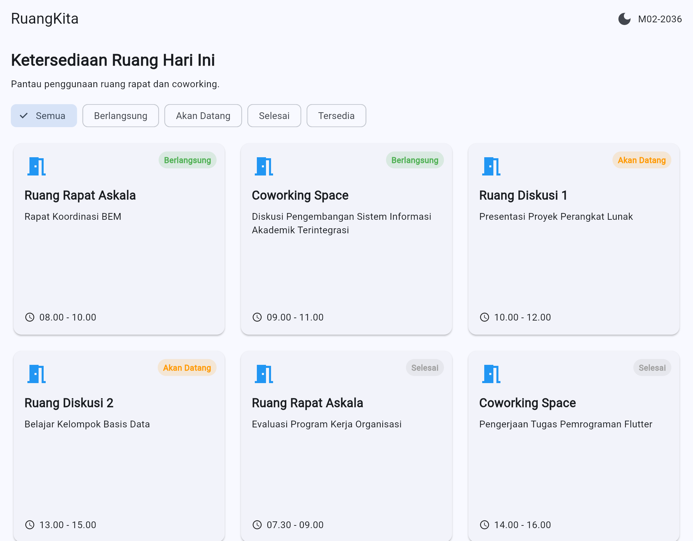
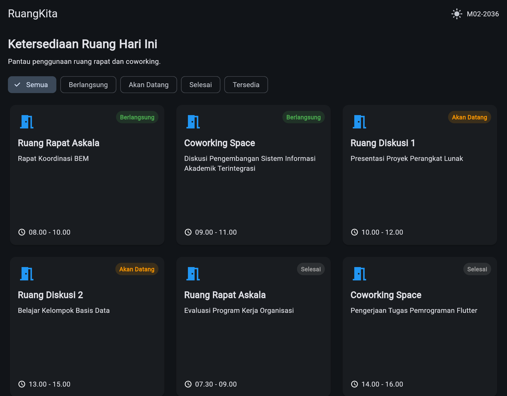

# RuangKita - Dashboard Ketersediaan Ruang

## 1. Identitas Mahasiswa

| Keterangan | Isi |
|---|---|
| Nama | [Raido Octaviandy] |
| NIM | [362558302036] |
| Program Studi | [Teknologi Rekayasa Perangkat Lunak] |
| Kelas | [TRPL 2C] |
| Varian | Ruang Rapat & Coworking |
| Kode Modul | M02-2036 |

---

## 2. Ringkasan Proyek

[RuangKita merupakan aplikasi dashboard ketersediaan ruang yang dibuat menggunakan Flutter. Aplikasi ini bertujuan untuk menampilkan informasi ruangan, aktivitas yang sedang berlangsung, jadwal kegiatan, dan status ketersediaan ruangan secara terstruktur.

Aplikasi memiliki fitur filter berdasarkan status ruangan, tampilan responsif untuk berbagai ukuran layar, serta tampilan detail ruangan melalui Bottom Sheet. Desain aplikasi disesuaikan agar dapat digunakan pada perangkat mobile, tablet, maupun desktop.]

### Arsitektur Widget

[Struktur widget pada aplikasi RuangKita menggunakan pendekatan widget tree Flutter yang terdiri dari MaterialApp, halaman RuangPraktikum, dan beberapa widget pendukung.

Widget utama yang digunakan adalah Scaffold untuk struktur halaman, AppBar untuk bagian judul, LayoutBuilder untuk mengatur tampilan berdasarkan ukuran layar, Wrap dan ChoiceChip untuk filter status, serta GridView.builder untuk menampilkan daftar ruangan secara dinamis.

Setiap kartu ruangan menggunakan beberapa widget seperti Card, Column, Row, Expanded, dan Stack untuk mengatur informasi ruangan, aktivitas, waktu, serta badge status. Ketika pengguna memilih salah satu ruangan, aplikasi menampilkan detail melalui Bottom Sheet.]

### Alasan Menggunakan StatefulWidget

[StatefulWidget digunakan karena aplikasi RuangKita memiliki tampilan yang dapat berubah berdasarkan interaksi pengguna. Contohnya adalah pemilihan filter status ruangan dan perubahan mode tampilan dark mode.

Dengan menggunakan StatefulWidget, perubahan data pada tampilan dapat dikelola menggunakan setState(). Ketika pengguna memilih status tertentu, aplikasi memperbarui data ruangan yang ditampilkan tanpa harus membuat halaman baru secara keseluruhan.]

---

## 3. Responsive Layout

| Breakpoint | Widget Layout | Alasan |
|---|---|---|
| < 600 px | [GridView dengan 1 kolom] | [Menyesuaikan layar mobile yang memiliki lebar terbatas agar informasi kartu tetap mudah dibaca dan tidak terlalu padat.] |
| 600–839 px | [GridView dengan 2 kolom] | [Memanfaatkan ruang layar tablet dengan menampilkan dua kartu dalam satu baris sehingga tampilan lebih efisien.] |
| >= 840 px | [GridView dengan 3 kolom] | [Memanfaatkan lebar layar desktop agar beberapa kartu ruangan dapat ditampilkan secara bersamaan dan mengurangi ruang kosong.] |

Pengaturan breakpoint dilakukan menggunakan LayoutBuilder sehingga jumlah kolom pada GridView dapat menyesuaikan lebar area layout yang tersedia.

## 4. Screenshot Running Application

### 4.1 Tampilan Mobile

 

### 4.2 Tampilan Tablet

### 4.3 Tampilan Desktop

### 4.4 Tampilan Detail Ruangan / Dark Mode

---

## 5. Tautan Commit Final

- Repository GitHub: [https://github.com/Raido53/Ruang-Kita.git]
- Commit final: [https://github.com/Raido53/Ruang-Kita/commit/5c542960efd6131556884a851a599079d6f75ad0]

---

## 6. Jawaban Refleksi

### 6.1 Mengapa Expanded Membantu Text di Dalam Row?

[Expanded membantu Text di dalam Row dengan memberikan ruang yang tersedia secara fleksibel. Dengan begitu, teks dapat menggunakan sisa ruang setelah widget lainnya ditempatkan.

Pada kartu ruangan, Expanded dapat membantu mencegah teks aktivitas atau nama ruangan bertabrakan dengan widget lain. Teks juga dapat menyesuaikan lebar yang tersedia sehingga tampilan lebih rapi dan mengurangi risiko overflow.]

### 6.2 Mengapa LayoutBuilder Lebih Tepat untuk Layout Lokal Dibanding Hanya MediaQuery?

[LayoutBuilder lebih tepat digunakan untuk mengatur layout lokal karena memberikan informasi mengenai batasan ukuran dari parent widget tempat komponen tersebut berada.

Sementara itu, MediaQuery biasanya digunakan untuk mendapatkan informasi ukuran layar atau konfigurasi perangkat secara keseluruhan. Dengan LayoutBuilder, jumlah kolom pada GridView dapat ditentukan berdasarkan lebar area yang benar-benar tersedia, sehingga lebih fleksibel ketika widget berada di dalam layout yang memiliki ukuran terbatas.]

### 6.3 Apa yang Berubah pada Widget Tree Ketika setState Dipanggil?

[Ketika setState() dipanggil, Flutter menandai State yang bersangkutan untuk dibangun ulang atau melakukan rebuild pada bagian widget tree yang terkait.

Pada aplikasi RuangKita, ketika pengguna memilih filter status, nilai selectedStatus diperbarui melalui setState(). Kemudian Flutter menjalankan kembali proses build untuk memperbarui tampilan berdasarkan status yang dipilih.

Widget tidak seluruhnya dibuat ulang dari awal secara manual. Flutter mengelola proses pembaruan widget berdasarkan perubahan state sehingga tampilan dapat menyesuaikan interaksi pengguna.]

---

